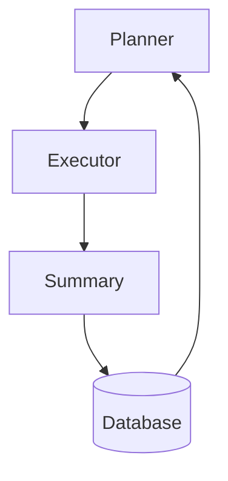

# General Evolve Agent Construction Guide

The General Evolve Agent is a core agent within the LoongFlow framework, adopting the Plan-Execute-Summary (PES) paradigm to solve complex mathematical optimization and algorithm improvement problems.

## 🎯 Agent Architecture

### Core Components

**1. Planner**
- Responsible for generating evolution strategies and mutation/crossover plans.
- Manages the balance between exploration and exploitation.
- Component Class: `EvolvePlanAgent`

**2. Executor**
- Generates and executes candidate code solutions.
- Manages the sandbox execution environment and error recovery.
- Component Classes: `EvolveExecuteAgentReact`, `EvolveExecuteAgentFuse`, etc.

**3. Summary**
- Evaluates the fitness score of solutions.
- Generates evolutionary insights and selection strategies.
- Component Class: `EvolveSummaryAgent`

### Workflow


## ⚙️ Configuration File Structure

```yaml
# task_config.yaml example
workspace_path: "./output"

# LLM Configuration
llm_config:
  url: "https://your-llm-api/v1"
  api_key: "your-api-key"
  model: "deepseek-r1-250528"
  temperature: 0.7
  context_length: 128000

# Component Configuration
planners:
  evolve_planner:
    react_max_steps: 10

executors:
  evolve_executor_fuse:
    max_rounds: 3
    react_max_steps: 15

summarizers:
  evolve_summary:
    react_max_steps: 6

# Evolution Process Configuration
evolve:
  task: "Task description..."
  planner_name: "evolve_planner"
  executor_name: "evolve_executor_fuse"
  summary_name: "evolve_summary"
  max_iterations: 1000
  target_score: 1.0
  
  evaluator:
    timeout: 1200
    
  database:
    storage_type: "in_memory"
    num_islands: 3
    population_size: 100
    checkpoint_interval: 10
```

## 🚀 Running the Agent

### Basic Execution
```bash
# Run using configuration file
python agents/general_evolve/general_evolve_agent.py \
    --config task_config.yaml \
    --task-file description.md \
    --eval-file evaluator.py \
    --max-iterations 500 \
    --log-level INFO
```

### Command Line Argument Overrides
```bash
# Override specific parameters from the configuration file
python agents/general_evolve/general_evolve_agent.py \
    --config config.yaml \
    --task "New task description" \
    --initial-file initial_code.py \
    --eval-file evaluator.py \
    --max-iterations 1000 \
    --planner evolve_planner \
    --executor evolve_executor_fuse \
    --summary evolve_summary
```

### Resuming from Checkpoint
```bash
# Resume previous evolutionary state
python agents/general_evolve/general_evolve_agent.py \
    --config config.yaml \
    --checkpoint-path ./output/database/checkpoints/checkpoint-iter-150
```

## 📁 Task File Structure

```
your_task/
├── task_config.yaml          # Main configuration file
├── description.md           # Task description (optional, use --task-file)
├── initial_code.py         # Initial code (optional, use --initial-file)
├── evaluator.py           # Evaluator function (required, use --eval-file)
└── requirements.txt        # Python dependencies (optional)
```

### Evaluator Function Template
```python
# evaluator.py
def evaluate(solution_code: str) -> dict:
    """
    Evaluate the solution and return scoring metrics
    
    Args:
        solution_code: Python code string to evaluate
        
    Returns:
        dict: A dictionary containing score(0.0-1.0), metrics, summary, and status
    """
    try:
        # Execute solution code
        # Compare with expected results
        # Calculate fitness score
        
        return {
            "score": 0.85,  # Range: 0.0 to 1.0
            "metrics": {
                "accuracy": 0.92,
                "efficiency": 0.78
            },
            "summary": "Solution performed well but can be optimized",
            "status": "success"
        }
    except Exception as e:
        return {
            "score": 0.0,
            "metrics": {"error": str(e)},
            "summary": "Solution execution failed",
            "status": "error"
        }
```

## 🔧 Component Customization

### Create Custom Planner
```python
from loongflow.framework.evolve.register import Worker

class CustomPlanner(Worker):
    def __init__(self, config: Any, db: EvolveDatabase):
        super().__init__()
        # Initialize configuration
        
    async def run(self, context: Context, message: Message) -> Message:
        # Custom planning logic
        return result_message
```

### Create Custom Executor
```python
class CustomExecutor(Worker):
    def __init__(self, config: Any, evaluator: LoongFlowEvaluator):
        super().__init__()
        self.evaluator = evaluator
        
    async def run(self, context: Context, message: Message) -> Message:
        # Custom execution logic
        return result_message
```

## 📊 Monitoring and Debugging

### Log Monitoring
```bash
# View evolution progress in real-time
tail -f output/logs/evolux.log

# Enable debug logs
python agents/general_evolve/general_evolve_agent.py --log-level DEBUG
```

### Visualization Dashboard
```bash
cd agents/general_evolve/visualizer
python visualizer.py --port 8888 --checkpoint-path output/database/checkpoints
```

Access http://localhost:8888 to view real-time evolution data.

## 🎯 Best Practices

### Task Design
1. **Clear Evaluation Criteria**: Ensure the evaluator function provides meaningful scores.
2. **Progressive Difficulty**: Start with simple versions and gradually increase complexity.
3. **Explicit Constraints**: Clearly define all constraints in the task description.

### Performance Optimization
1. **Number of Islands**: Most problems use 3-5 islands.
2. **Population Size**: Initial setting of 50-100 individuals.
3. **Checkpoint Frequency**: Save every 10-20 iterations.

### Error Handling
```python
# Robust evaluator function design
def safe_evaluate(solution_code):
    try:
        # Isolated execution environment
        with timeout(30):  # 30 seconds timeout
            return evaluate_solution(solution_code)
    except TimeoutError:
        return {"score": 0.0, "status": "timeout"}
    except Exception as e:
        return {"score": 0.0, "status": "error", "error": str(e)}
```

## 🚨 FAQ

### Convergence Issues
- Increase population size or number of islands.
- Adjust mutation/crossover rates.
- Improve granularity of the evaluator function.

### Memory Issues
- Reduce population size for large problems.
- Use Redis backend for persistent storage.
- Implement solution pruning.

### Execution Errors
- Add timeout protection in the evaluator.
- Validate solution code syntax before execution.
- Use sandbox execution environments.

## 📚 Example Tasks

The project provides several example tasks located in the `agents/general_evolve/examples/` directory:
- `math_flip`: Mathematical function optimization
- `packing_circle_in_unit_square`: Geometric packing problem
- `heilbronn_problem`: Number theory problem

These examples demonstrate how to build complete evolutionary task configurations.