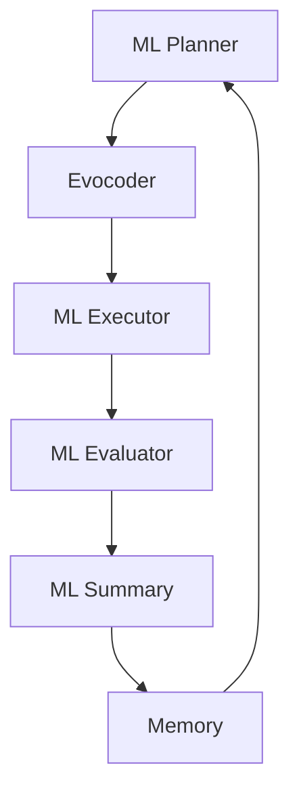

# ML Evolve Agent

ML Evolve Agent is a specialized agent within the LoongFlow framework designed for automated machine learning, focusing on solving Kaggle-style competitions and MLE-Bench problems.

## 🏗️ Architecture Overview

ML Evolve Agent adopts an evolutionary algorithm framework, containing the following core components:



### Core Component Functions

**ML Planner** - Machine Learning Planner
- Analyzes dataset characteristics and task requirements
- Formulates machine learning pipeline strategies
- Determines feature engineering and model selection schemes

**Evocoder** - Code Generator
- Generates machine learning code by stages
- Supports modules for data preprocessing, model training, prediction, etc.
- Verifies code executability via the evaluator

**ML Executor** - Executor
- Runs the generated machine learning pipelines
- Manages GPU/CPU resource allocation
- Handles large-scale dataset training

**ML Evaluator** - Evaluator
- Executes evaluation functions to calculate model performance
- Verifies prediction results and submission formats
- Ensures safe execution in independent processes

**ML Summary** - Summarizer
- Analyzes iteration results and performance metrics
- Generates improvement suggestions and learning insights

## 🚀 Quick Start

### Run Example Task

```bash
# Initialize environment
./run_ml.sh init

# Run Iris classification example
./run_ml.sh run ml_example --background

# Monitor progress
tail -f output/logs/evolux.log

# Stop task
./run_ml.sh stop ml_example
```

### Task Configuration Example

Create a `task_config.yaml` configuration file:

```yaml
workspace_path: "./output"

# LLM Configuration (Required)
llm_config:
  url: "https://your-llm-api/v1"
  api_key: "your-api-key"
  model: "deepseek-v3"
  temperature: 0.8
  context_length: 128000
  max_tokens: 32768

# Component Configuration
planners:
  ml_planner:
    react_max_steps: 10
    evo_coder_timeout: 3600

executors:
  ml_executor:
    react_max_steps: 10
    evo_coder_timeout: 43200  # 12 hours

summarizers:
  ml_summary:
    react_max_steps: 10

# Evolution Configuration
evolve:
  planner_name: "ml_planner"
  executor_name: "ml_executor"
  summary_name: "ml_summary"
  max_iterations: 100
  target_score: 1.0
  evaluator:
    timeout: 1800
```

## 📁 Task Directory Structure

Create a custom machine learning task:

```
your_ml_task/
├── task_config.yaml        # Task configuration
├── eval_program.py         # Evaluation function
├── public/
│   ├── description.md      # Task description (visible to agent)
│   ├── train.csv           # Training data
│   ├── test.csv            # Test features
│   └── sample_submission.csv
└── private/
    └── answer.csv          # Ground truth (invisible to agent)
```

### Evaluation Function Template

```python
# eval_program.py
def evaluate(task_data_path: str, best_code_path: str, artifacts: dict) -> dict:
    """
    Evaluate machine learning solution
    
    Returns:
        dict containing: status, summary, score(0.0-1.0), metrics, artifacts
    """
    import pandas as pd
    from sklearn.metrics import accuracy_score
    
    # Load ground truth
    answers = pd.read_csv(f"{task_data_path}/private/answer.csv")
    
    # Load predictions generated by the agent
    predictions = load_predictions(best_code_path)
    
    # Calculate metrics
    accuracy = accuracy_score(answers['target'], predictions)
    
    return {
        "status": "success",
        "summary": f"Model Accuracy: {accuracy:.4f}",
        "score": accuracy,
        "metrics": {"accuracy": accuracy},
        "artifacts": artifacts
    }
```

## 🔧 Advanced Configuration

### GPU Resource Optimization

```yaml
# Optimize GPU usage in task_config.yaml
ml_executor:
  use_gpu: true
  batch_size: 32
  mixed_precision: true
```

### Competition Task Specific Settings

```yaml
evolve:
  competition_type: "classification"  # classification/regression/ranking
  evaluation_metric: "accuracy"       # Primary optimization metric
  time_budget: 86400                  # Time budget (seconds)
```

## 📊 Output Structure

After task completion, results are saved in the `output/` directory:

```
output/
├── <task-uuid>/
│   └── <iteration-id>/      # Each iteration
│       ├── planner/         # Planning results
│       ├── evocoder/        # Generated code
│       ├── executor/        # Execution results
│       └── summary/         # Summary analysis
├── logs/                    # Run logs
├── database/                # Checkpoints and solutions
└── evaluate/                # Evaluation results
```

## 🎯 Best Practices

### Data Preparation
1. **Data Exploration**: Ensure good dataset quality
2. **Feature Verification**: Avoid data leakage
3. **Cross-Validation**: Use appropriate validation strategies

### Model Development
1. **Baseline Model**: Start with simple models
2. **Progressive Improvement**: Gradually increase complexity
3. **Ensemble Strategy**: Combine multiple model types

### Troubleshooting
- **Overfitting**: Increase validation strictness, use early stopping
- **Resource Limits**: Optimize batch size, use memory-efficient data types
- **Evaluation Failure**: Check data format and evaluation function

## 🔄 MLE-Bench Integration

ML Evolve Agent fully supports MLE-Bench competitions:

```bash
# Initialize MLE-Bench environment
./run_mlebench.sh init

# Prepare competition data
./run_mlebench.sh prepare detecting-insults-in-social-commentary

# Run competition
./run_mlebench.sh run detecting-insults-in-social-commentary --background
```

ML Evolve Agent provides a complete automated machine learning solution, especially suitable for data science competitions and end-to-end machine learning tasks.