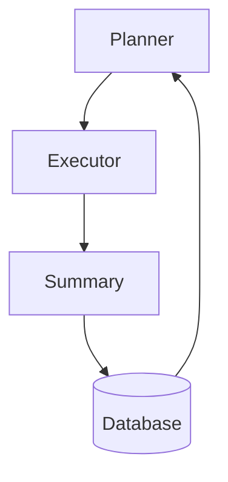

# General Evolve Agent 构建指南

General Evolve Agent 是 LoongFlow 框架中的核心代理，采用 Plan-Execute-Summary (PES) 范式来解决复杂的数学优化和算法改进问题。

## 🎯 代理架构

### 核心组件

**1. Planner (规划器)**
- 负责生成进化策略和变异/交叉计划
- 管理探索与利用的平衡
- 组件类：`EvolvePlanAgent`

**2. Executor (执行器)**
- 生成并执行候选代码解决方案
- 管理沙箱执行环境和错误恢复
- 组件类：`EvolveExecuteAgentReact`、`EvolveExecuteAgentFuse` 等

**3. Summary (总结器)**
- 评估解决方案的适应度分数
- 生成进化洞察和选择策略
- 组件类：`EvolveSummaryAgent`

### 工作流程


## ⚙️ 配置文件结构

```yaml
# task_config.yaml 示例
workspace_path: "./output"

# LLM 配置
llm_config:
  url: "https://your-llm-api/v1"
  api_key: "your-api-key"
  model: "deepseek-r1-250528"
  temperature: 0.7
  context_length: 128000

# 组件配置
planners:
  evolve_planner:
    react_max_steps: 10

executors:
  evolve_executor_fuse:
    max_rounds: 3
    react_max_steps: 15

summarizers:
  evolve_summary:
    react_max_steps: 6

# 进化过程配置
evolve:
  task: "任务描述..."
  planner_name: "evolve_planner"
  executor_name: "evolve_executor_fuse"
  summary_name: "evolve_summary"
  max_iterations: 1000
  target_score: 1.0
  
  evaluator:
    timeout: 1200
    
  database:
    storage_type: "in_memory"
    num_islands: 3
    population_size: 100
    checkpoint_interval: 10
```

## 🚀 运行代理

### 基本运行方式
```bash
# 使用配置文件运行
python agents/general_evolve/general_evolve_agent.py \
    --config task_config.yaml \
    --task-file description.md \
    --eval-file evaluator.py \
    --max-iterations 500 \
    --log-level INFO
```

### 命令行参数覆盖
```bash
# 覆盖配置文件的各项参数
python agents/general_evolve/general_evolve_agent.py \
    --config config.yaml \
    --task "新的任务描述" \
    --initial-file initial_code.py \
    --eval-file evaluator.py \
    --max-iterations 1000 \
    --planner evolve_planner \
    --executor evolve_executor_fuse \
    --summary evolve_summary
```

### 从检查点恢复
```bash
# 恢复之前的进化状态
python agents/general_evolve/general_evolve_agent.py \
    --config config.yaml \
    --checkpoint-path ./output/database/checkpoints/checkpoint-iter-150
```

## 📁 任务文件结构

```
your_task/
├── task_config.yaml          # 主配置文件
├── description.md           # 任务描述（可选使用 --task-file）
├── initial_code.py         # 初始代码（可选使用 --initial-file）
├── evaluator.py           # 评估函数（必需，使用 --eval-file）
└── requirements.txt        # Python依赖（可选）
```

### 评估函数模板
```python
# evaluator.py
def evaluate(solution_code: str) -> dict:
    """
    评估解决方案并返回评分指标
    
    Args:
        solution_code: 要评估的Python代码字符串
        
    Returns:
        dict: 包含score(0.0-1.0)、metrics、summary、status的字典
    """
    try:
        # 执行解决方案代码
        # 与预期结果进行比较
        # 计算适应度分数
        
        return {
            "score": 0.85,  # 范围: 0.0到1.0
            "metrics": {
                "accuracy": 0.92,
                "efficiency": 0.78
            },
            "summary": "解决方案表现良好但可以优化",
            "status": "success"
        }
    except Exception as e:
        return {
            "score": 0.0,
            "metrics": {"error": str(e)},
            "summary": "解决方案执行失败",
            "status": "error"
        }
```

## 🔧 组件定制

### 创建自定义 Planner
```python
from loongflow.framework.evolve.register import Worker

class CustomPlanner(Worker):
    def __init__(self, config: Any, db: EvolveDatabase):
        super().__init__()
        # 初始化配置
        
    async def run(self, context: Context, message: Message) -> Message:
        # 自定义规划逻辑
        return result_message
```

### 创建自定义 Executor
```python
class CustomExecutor(Worker):
    def __init__(self, config: Any, evaluator: LoongFlowEvaluator):
        super().__init__()
        self.evaluator = evaluator
        
    async def run(self, context: Context, message: Message) -> Message:
        # 自定义执行逻辑
        return result_message
```

## 📊 监控与调试

### 日志监控
```bash
# 实时查看进化进度
tail -f output/logs/evolux.log

# 启用调试日志
python agents/general_evolve/general_evolve_agent.py --log-level DEBUG
```

### 可视化仪表板
```bash
cd agents/general_evolve/visualizer
python visualizer.py --port 8888 --checkpoint-path output/database/checkpoints
```

访问 http://localhost:8888 查看实时进化数据。

## 🎯 最佳实践

### 任务设计
1. **清晰的评估标准**: 确保评估函数提供有意义的分数
2. **渐进式难度**: 从简单版本开始，逐步增加复杂度
3. **明确约束**: 在任务描述中明确定义所有约束条件

### 性能优化
1. **岛屿数量**: 大多数问题使用3-5个岛屿
2. **种群大小**: 初始设置50-100个个体
3. **检查点频率**: 每10-20次迭代保存一次

### 错误处理
```python
# 稳健的评估函数设计
def safe_evaluate(solution_code):
    try:
        # 隔离执行环境
        with timeout(30):  # 30秒超时
            return evaluate_solution(solution_code)
    except TimeoutError:
        return {"score": 0.0, "status": "timeout"}
    except Exception as e:
        return {"score": 0.0, "status": "error", "error": str(e)}
```

## 🚨 常见问题

### 收敛问题
- 增加种群大小或岛屿数量
- 调整变异/交叉率
- 改进评估函数的粒度

### 内存问题
- 对于大型问题减小种群大小
- 使用Redis后端进行持久化存储
- 实现解决方案修剪

### 执行错误
- 在评估器中添加超时保护
- 在执行前验证解决方案代码语法
- 使用沙箱执行环境

## 📚 示例任务

项目提供了多个示例任务，位于 `agents/general_evolve/examples/` 目录下：
- `math_flip`: 数学函数优化
- `packing_circle_in_unit_square`: 几何体装填问题  
- `heilbronn_problem`: 数论问题

这些示例展示了如何构建完整的进化任务配置。