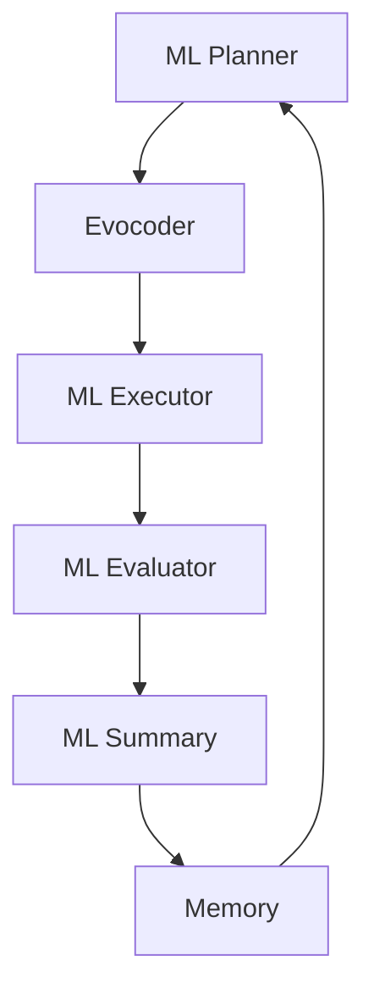

# ML Evolve Agent

ML Evolve Agent 是 LoongFlow 框架中专门用于自动化机器学习的智能体，专注于解决 Kaggle 风格的竞赛和 MLE-Bench 问题。

## 🏗️ 架构概述

ML Evolve Agent 采用进化算法框架，包含以下核心组件：



### 核心组件功能

**ML Planner** - 机器学习规划器
- 分析数据集特征和任务需求
- 制定机器学习管道策略
- 确定特征工程和模型选择方案

**Evocoder** - 代码生成器
- 按阶段生成机器学习代码
- 支持数据预处理、模型训练、预测等模块
- 通过评估器验证代码可执行性

**ML Executor** - 执行器
- 运行生成的机器学习管道
- 管理 GPU/CPU 资源分配
- 处理大规模数据集训练

**ML Evaluator** - 评估器
- 执行评估函数计算模型性能
- 验证预测结果和提交格式
- 在独立进程中确保安全执行

**ML Summary** - 总结器
- 分析迭代结果和性能指标
- 生成改进建议和学习洞察

## ?? 快速开始

### 运行示例任务

```bash
# 初始化环境
./run_ml.sh init

# 运行 Iris 分类示例
./run_ml.sh run ml_example --background

# 监控进度
tail -f output/logs/evolux.log

# 停止任务
./run_ml.sh stop ml_example
```

### 任务配置示例

创建 `task_config.yaml` 配置文件：

```yaml
workspace_path: "./output"

# LLM 配置（必需）
llm_config:
  url: "https://your-llm-api/v1"
  api_key: "your-api-key"
  model: "deepseek-v3"
  temperature: 0.8
  context_length: 128000
  max_tokens: 32768

# 组件配置
planners:
  ml_planner:
    react_max_steps: 10
    evo_coder_timeout: 3600

executors:
  ml_executor:
    react_max_steps: 10
    evo_coder_timeout: 43200  # 12小时

summarizers:
  ml_summary:
    react_max_steps: 10

# 进化配置
evolve:
  planner_name: "ml_planner"
  executor_name: "ml_executor"
  summary_name: "ml_summary"
  max_iterations: 100
  target_score: 1.0
  evaluator:
    timeout: 1800
```

## 📁 任务目录结构

创建自定义机器学习任务：

```
your_ml_task/
├── task_config.yaml        # 任务配置
├── eval_program.py         # 评估函数
├── public/
│   ├── description.md      # 任务描述（智能体可见）
│   ├── train.csv           # 训练数据
│   ├── test.csv            # 测试特征
│   └── sample_submission.csv
└── private/
    └── answer.csv          # 真实标签（智能体不可见）
```

### 评估函数模板

```python
# eval_program.py
def evaluate(task_data_path: str, best_code_path: str, artifacts: dict) -> dict:
    """
    评估机器学习解决方案
    
    返回:
        dict 包含: status, summary, score(0.0-1.0), metrics, artifacts
    """
    import pandas as pd
    from sklearn.metrics import accuracy_score
    
    # 加载真实标签
    answers = pd.read_csv(f"{task_data_path}/private/answer.csv")
    
    # 加载智能体生成的预测结果
    predictions = load_predictions(best_code_path)
    
    # 计算指标
    accuracy = accuracy_score(answers['target'], predictions)
    
    return {
        "status": "success",
        "summary": f"模型准确率: {accuracy:.4f}",
        "score": accuracy,
        "metrics": {"accuracy": accuracy},
        "artifacts": artifacts
    }
```

## 🔧 高级配置

### GPU 资源优化

```yaml
# 在 task_config.yaml 中优化 GPU 使用
ml_executor:
  use_gpu: true
  batch_size: 32
  mixed_precision: true
```

### 竞争任务特定设置

```yaml
evolve:
  competition_type: "classification"  # 分类/回归/排序
  evaluation_metric: "accuracy"       # 主要优化指标
  time_budget: 86400                 # 时间限制(秒)
```

## 📊 输出结构

任务完成后，结果保存在 `output/` 目录：

```
output/
├── <task-uuid>/
│   └── <iteration-id>/      # 每次迭代
│       ├── planner/         # 规划结果
│       ├── evocoder/        # 生成代码
│       ├── executor/        # 执行结果
│       └── summary/         # 总结分析
├── logs/                    # 运行日志
├── database/                # 检查点和解决方案
└── evaluate/                # 评估结果
```

## 🎯 最佳实践

### 数据准备
1. **数据探索**: 确保数据集质量良好
2. **特征验证**: 避免数据泄露
3. **交叉验证**: 使用合适的验证策略

### 模型开发
1. **基准模型**: 从简单模型开始
2. **渐进改进**: 逐步增加复杂性
3. **集成策略**: 组合多个模型类型

### 故障排查
- **过拟合**: 增加验证严格性，使用早停
- **资源限制**: 优化批大小，使用内存高效数据类型
- **评估失败**: 检查数据格式和评估函数

## 🔄 MLE-Bench 集成

ML Evolve Agent 完整支持 MLE-Bench 竞赛：

```bash
# 初始化 MLE-Bench 环境
./run_mlebench.sh init

# 准备竞赛数据
./run_mlebench.sh prepare detecting-insults-in-social-commentary

# 运行竞赛
./run_mlebench.sh run detecting-insults-in-social-commentary --background
```

ML Evolve Agent 提供了一个完整的自动化机器学习解决方案，特别适用于数据科学竞赛和端到端的机器学习任务。